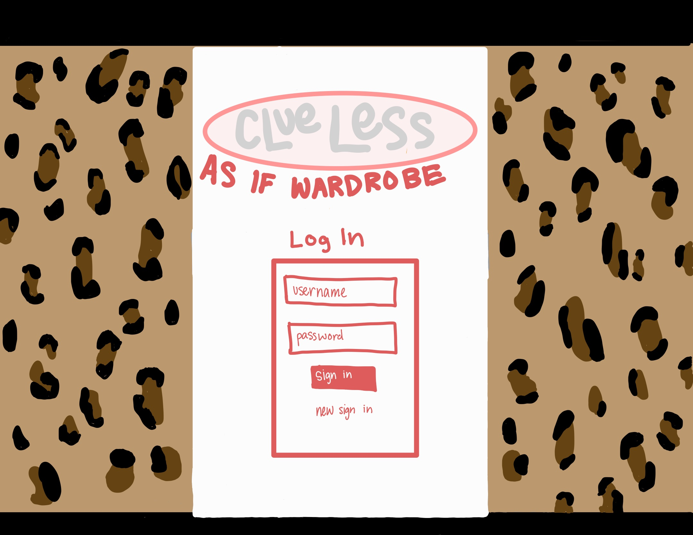
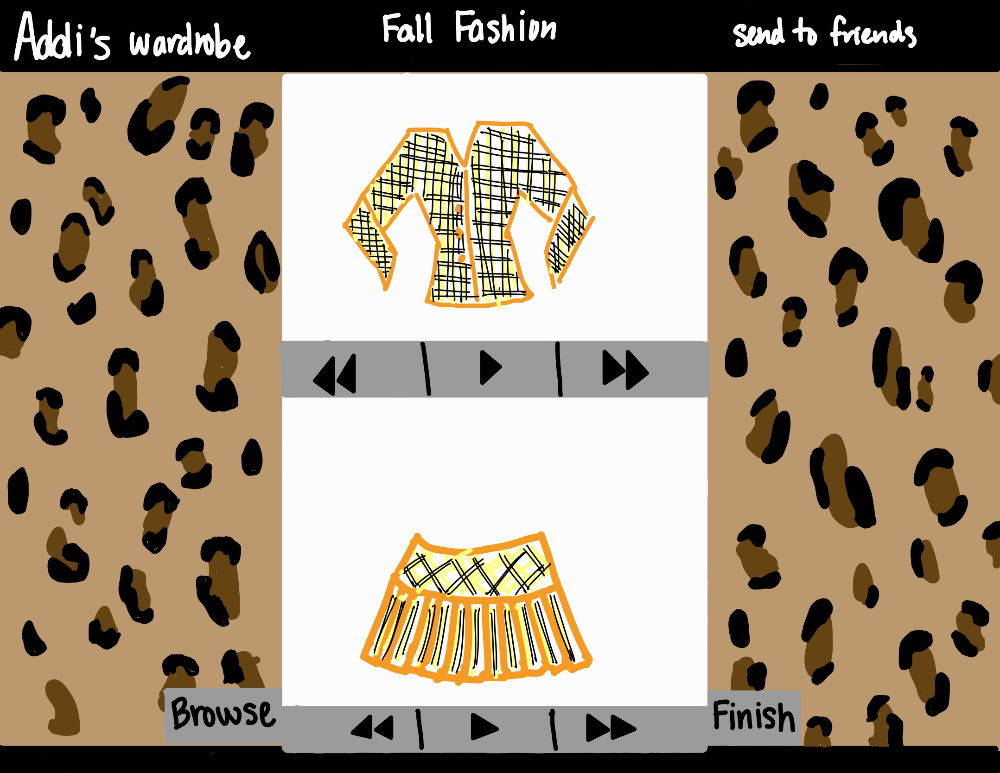

# As If Wardrobe

## Specification Deliverable 

### Elevator Pitch
Growing up, every girl dreamed of having Cher’s closet from the 1995 chick flick, 'Clueless'. Not only her wardrobe but her iconic closet app as well. 'As If Outfits' brings this movie 90’s application to life in a modern way. Staying through to the 90’s theme depicted in the film, this web service allows one to plan outfits seamlessly without sorting through a wardrobe manually, being able to plan out outfits throughout the week. Not only this, but 'As If Outfits' also allows you to send your outfits choices to friends allowing collaborating on each other's outfits.

### Design

### Key features

- Secure login over HTTPS
- Display of outfit choices
- Ability to select, change and scroll through inventory
- Capability to upload wardrobe onto website
- Ability to save chosen outfit and send to others

### Technologies

I am going to use the required technologies for this project in the following ways.

- **HTML** - Uses HTML structure for creating 2 HTML pages. One for a login page, and the other for choosing ones outfit.

- **CSS** - Uses CSS to style website like a '90s throwback, inspired by the movie Clueless. It'll handle layouts, colors, and making sure everything looks good on different devices.

- **React** - Provides secure login, outfit display, photo upload interface, display other users reactions, and routing components.

- **Service** - Provides a backend with endpoints to support various functionalities:
    - secure login
    - upload wardrobe items
    - ability to send outfits
    - retrieve outfits

- **DB/Login** - stores user information and wardrobe items in the database. User credentials are stored securely, only authenticated users can access and modify their wardrobe and outfits. The database also supports features like user registration, login, and shared outfit tracking.

- **WebSocket** - Enables real-time communication between users, allowing them to see updates and interactions from others immediately.
## HTML Deliverable 
For this deliverable, I built out the structure of my application using HTML.

 - **HTML pages** - 4 HTML pages for an about page, index page, wardrobe page, and friends page
 
-  **Links** - links to navigate between pages
  
 - **Text** - Each page has description text, and the About page gives context to the why behind the application
   
 - **Images** - Clueless logo images on page

 - **DB/Login** - login button with username and password, as well as buttons to scroll through outfits

 - **WebSocket** - Page where you can view your friend's outfits and upload wardrobes for yourself

 ## CSS Deliverable 
For this deliverable, I built out the structure of my application using CSS.

 - **Header, Footer, and main content body** 
 
-  **Navigation Elements** - changed the color of anchor elements
  
 - **Responsive to window resizing** - Page looks great on all window sizes and devices
   
 - **Application elements** - good contrast between text and background

 - **Application text content** - consitent fonts and colors throughout website

 - **Application images** - All images are relevant and load properly

## CSS Deliverable 
For this deliverable, I built out the structure of my application using CSS.

 - **Header, Footer, and main content body** 
 
-  **Navigation Elements** - changed the color of anchor elements
  
 - **Responsive to window resizing** - Page looks great on all window sizes and devices
   
 - **Application elements** - good contrast between text and background

 - **Application text content** - consitent fonts and colors throughout website

 - **Application images** - All images are relevant and load properly

 ## REACT Deliverable 
For this deliverable, I built out the structure of my application using React.

 - **Header, Footer, and main content body** Implemented fixed navbar and footer across pages.
 
-  **Navigation Elements** - Used React Router for seamless page navigation.
  
 - **Responsive to window resizing** - Ensured layout adapts to different screen sizes.
   
 - **Application elements** - Styled form inputs, buttons, and navigation for consistency.

 - **Application text content** - Consistent headings and descriptive text across pages.

 - **Application images** - Loaded and displayed background and profile images.

 ## Service Deliverable 
For this deliverable, I built out the structure of my application using vite and javascript.

 - **Login** Endpoint to authenticate users.
 
-  **Upload wardrobe items** - Allows users to add items to their wardrobe.
  
 - **Send outfits** - Allows users to share outfits with friends.
   
 - **Retrieve outfits** - Fetches shared outfits for the user.

 - **Next and previous outfits** - Navigation through the wardrobe outfits.

 - **Save an outfit** - Allows users to save an outfit for later use.